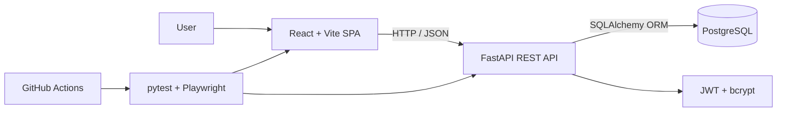

# Mini Issue Tracker

[](https://github.com/AnujjjGit/mini-issue-tracker/actions/workflows/ci.yml)

A production-minded full-stack issue tracking system built to make the engineering trade-offs visible: secure authentication, ownership-based authorization, a relational data model, automated API/UI testing, CI, and a documented path from a single-node deployment to larger-scale architecture.

**Stack:** FastAPI · PostgreSQL · SQLAlchemy · React/Vite · REST · JWT · Docker · pytest · Playwright · GitHub Actions

**Quality signals:** 50 automated tests · PostgreSQL-backed CI · IDOR/JWT/injection coverage · one-command Docker startup

---

## Why I built it this way

An issue tracker is simple at the CRUD layer; the interesting engineering questions sit underneath it:

- Can one user modify another user's data?
- Does validation hold when the frontend is bypassed?
- Are search inputs safe against injection?
- Can the same API run against a lightweight local database and PostgreSQL in CI?
- Do the tests protect behavior rather than just execute code?
- What changes as usage grows from hundreds to millions of users?

I therefore optimized for **correctness, security, testability, and explicit system-design trade-offs** rather than feature count.

## Architecture



The application uses a conventional three-tier design:

- **Frontend:** React + Vite dashboard, project views, issue forms, and a Kanban workflow.
- **Backend:** FastAPI REST API with Pydantic validation, JWT authentication, structured errors, and ownership checks.
- **Database:** PostgreSQL in Docker/CI; SQLite is available for fast local development and tests through the same SQLAlchemy models.
- **Delivery:** Docker Compose starts the full stack; GitHub Actions runs lint, API tests against PostgreSQL, UI tests, and Docker builds.

## Core engineering decisions

### Authorization before convenience
Every protected resource is ownership-scoped. Cross-user update attempts return `403`, and tests verify that the underlying record remains unchanged. This directly covers broken-object-level authorization / IDOR risk.

### Server-side validation
Pydantic validates requests at the API boundary so correctness does not depend on frontend controls. Invalid enum values, malformed emails, and incomplete payloads fail deterministically.

### Parameterized data access
SQLAlchemy handles query parameterization. The test suite sends SQL-injection-style payloads through search parameters and verifies they are treated as literal data without leaking records or damaging schema.

### Stateless authentication
JWT access tokens keep the API tier stateless, which makes horizontal scaling straightforward. The trade-off is revocation: production hardening would add short-lived access tokens plus refresh-token rotation / denylisting.

### REST over GraphQL
Projects and issues are resource-oriented with predictable access patterns. REST keeps the API simpler to document, test, cache, and operate, while FastAPI exposes OpenAPI/Swagger automatically.

## Automated testing

The test strategy follows a test-pyramid approach: broad, fast API coverage with a deliberately smaller set of browser journeys.

| Layer | Coverage | Examples |
|---|---:|---|
| API | 45 tests | auth, projects, issues, filters, validation, IDOR, JWT tampering, SQL injection, password hashing |
| UI | 5 Playwright tests | login, negative login, create project, create issue, Kanban status transition |
| CI | 4 jobs | Ruff lint, PostgreSQL API tests, Playwright UI tests, Docker build |

The same API suite runs quickly on SQLite locally and against **real PostgreSQL in CI**, which is a useful portability check rather than assuming ORM code behaves identically across engines.

## Run locally

### Docker — recommended

```bash
docker compose up --build
```

Then open:

- Frontend: `http://localhost:5173`
- API / Swagger: `http://localhost:8000/docs`

Stop with:

```bash
docker compose down
```

### Local development

Backend:

```bash
cd backend
python3 -m venv .venv
source .venv/bin/activate
pip install -r requirements-dev.txt
uvicorn app.main:app --reload
```

Frontend in a second terminal:

```bash
cd frontend
npm install
npm run dev
```

## Run the tests

```bash
# API suite
pytest tests/api

# UI suite — app must be running
python -m playwright install chromium
pytest tests/ui

# Lint
ruff check backend tests
```

## Data model

```text
users 1 ──── * projects 1 ──── * issues
```

The generated PostgreSQL DDL lives in [`docs/schema.sql`](docs/schema.sql). Foreign keys preserve relational integrity; searchable/filterable fields are indexed where appropriate.

## Scaling path

**~100 users:** one FastAPI instance + one PostgreSQL instance is sufficient. Optimize for correctness and observability before adding infrastructure.

**~10K users:** run multiple stateless API instances behind a load balancer, add connection pooling and targeted indexes, and cache expensive read paths such as dashboard aggregates.

**~1M users:** add autoscaling, Redis caching, read replicas for read-heavy workloads, CDN delivery for the frontend, asynchronous/background work through a queue, stronger observability, and potentially partition issues by tenant/project. At this point, the data layer—not stateless JWT validation—is likely to become the primary scaling constraint.

## Security measures

- bcrypt password hashing; plaintext passwords are never persisted
- JWT signature and expiry validation
- explicit project/issue ownership checks
- server-side Pydantic validation
- parameterized SQLAlchemy queries
- structured errors without stack-trace leakage
- regression tests for authorization and malicious-input paths

## Deliberate limitations

The current version intentionally leaves several production-hardening items explicit rather than hiding them:

- no login rate limiting / brute-force protection
- no refresh-token rotation or immediate JWT revocation
- no pagination for very large issue lists
- schema bootstrapping via `create_all` rather than Alembic migrations
- intentionally minimal frontend styling

Those are the first areas I would address before a real multi-tenant production deployment.

## Repository structure

```text
backend/                  FastAPI app, models, schemas, routers, security
frontend/                 React + Vite SPA

tests/api/                pytest API + security tests
tests/ui/                 Playwright browser tests

docs/schema.sql           relational schema
.github/workflows/ci.yml  lint + Postgres tests + UI tests + Docker build
docker-compose.yml        one-command local stack
```

## What this project demonstrates

This repository is intentionally broader than a CRUD demo. It demonstrates how I approach an ambiguous product problem: identify the highest-risk failure modes, make architecture choices explicit, automate the important checks, and document what would need to change as the system grows.
